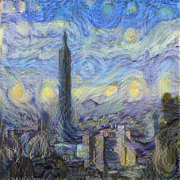

# Neural Art in TensorFlow

TensorFlow-slim implementation of [A Neural Algorithm of Artistic Style](https://arxiv.org/abs/1508.06576) using tf-slim [VGG-19 pre-trained model](https://github.com/tensorflow/models/tree/master/slim)

## References

- [ckmarkoh/neuralart_tensorflow](https://github.com/ckmarkoh/neuralart_tensorflow)